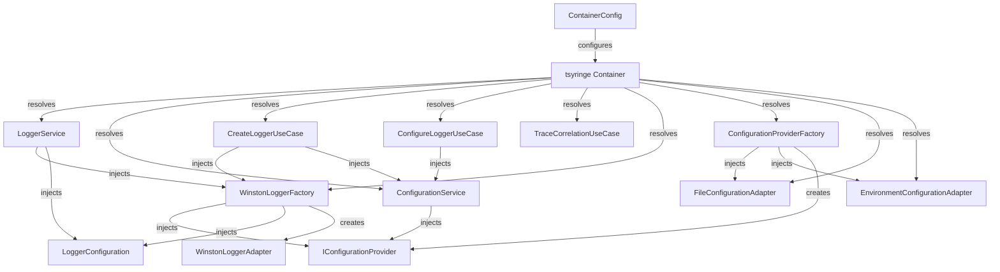
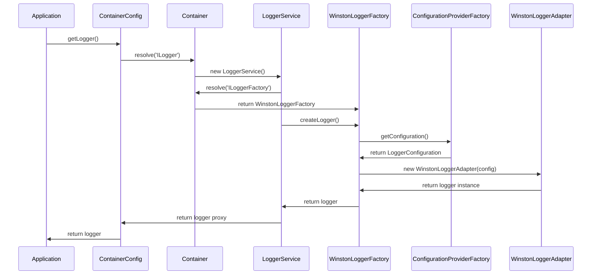
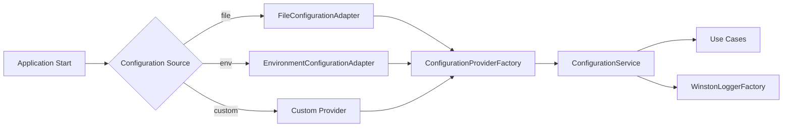

# Dependency Injection Architecture

## Overview
This logger library uses **tsyringe** for dependency injection, following a clean architecture pattern with clear separation of concerns across Domain, Application, Infrastructure, and Presentation layers.

## Dependency Flow Diagram



## Dependency Registration Flow

### 1. Container Configuration (`ContainerConfig.ts`)

```typescript
// Registration order and dependencies:

1. Register Adapters (Singletons)
   - FileConfigurationAdapter
   - EnvironmentConfigurationAdapter

2. Register Factories (Singletons)
   - ConfigurationProviderFactory
   - WinstonLoggerFactory

3. Create and Register Provider Instance
   - ConfigurationProviderFactory.create() → IConfigurationProvider

4. Register Configuration Instance
   - LoggerConfiguration (default or custom)

5. Register Application Services (Singletons)
   - ConfigurationService
   - LoggerService

6. Register Use Cases (Singletons)
   - CreateLoggerUseCase
   - ConfigureLoggerUseCase
   - TraceCorrelationUseCase

7. Register Interface Aliases
   - ILogger → LoggerService
```

## Detailed Class Dependencies

### Core Services

#### `LoggerService` (Application Layer)
```typescript
@injectable()
class LoggerService implements ILogger {
  constructor(
    @inject('ILoggerFactory') private loggerFactory: ILoggerFactory,
    @inject('LoggerConfiguration') private config: LoggerConfiguration
  )
}
```
**Dependencies:**
- `ILoggerFactory` → `WinstonLoggerFactory`
- `LoggerConfiguration` → Default or custom config

#### `ConfigurationService` (Application Layer)
```typescript
@injectable()
class ConfigurationService {
  constructor(
    @inject('IConfigurationProvider') private configProvider: IConfigurationProvider
  )
}
```
**Dependencies:**
- `IConfigurationProvider` → Created by `ConfigurationProviderFactory`

### Factories

#### `WinstonLoggerFactory` (Infrastructure Layer)
```typescript
@injectable()
class WinstonLoggerFactory implements ILoggerFactory {
  constructor(
    @inject('IConfigurationProvider') private configProvider: IConfigurationProvider,
    @inject('LoggerConfiguration') private defaultConfig: LoggerConfiguration
  )
}
```
**Dependencies:**
- `IConfigurationProvider` → Configuration provider instance
- `LoggerConfiguration` → Default configuration
**Creates:** `WinstonLoggerAdapter` instances

#### `ConfigurationProviderFactory` (Infrastructure Layer)
```typescript
@injectable()
class ConfigurationProviderFactory {
  constructor(
    @inject('FileConfigurationAdapter') private fileAdapter: IConfigurationProvider,
    @inject('EnvironmentConfigurationAdapter') private envAdapter: IConfigurationProvider
  )
}
```
**Dependencies:**
- `FileConfigurationAdapter` → File-based configuration
- `EnvironmentConfigurationAdapter` → Environment-based configuration
**Creates:** Appropriate `IConfigurationProvider` based on options

### Use Cases

#### `CreateLoggerUseCase` (Application Layer)
```typescript
class CreateLoggerUseCase {
  constructor(
    loggerFactory: ILoggerFactory,    // → WinstonLoggerFactory
    configService: ConfigurationService
  )
}
```
**Dependencies:**
- `ILoggerFactory` → `WinstonLoggerFactory`
- `ConfigurationService` → Configuration management

#### `ConfigureLoggerUseCase` (Application Layer)
```typescript
class ConfigureLoggerUseCase {
  constructor(
    configService: ConfigurationService
  )
}
```
**Dependencies:**
- `ConfigurationService` → Configuration management

### Adapters (Infrastructure Layer)

#### `FileConfigurationAdapter`
- **No dependencies** (reads from file system)
- Implements `IConfigurationProvider`

#### `EnvironmentConfigurationAdapter`
- **No dependencies** (reads from environment variables)
- Implements `IConfigurationProvider`

#### `WinstonLoggerAdapter`
- **Created by:** `WinstonLoggerFactory`
- **No injected dependencies** (receives configuration in constructor)
- Implements `ILogger`

## Initialization Flow

### 1. Application Startup
```typescript
// 1. Configure container
ContainerConfig.configure(options);

// 2. Container resolves LoggerService
const logger = ContainerConfig.getLogger();
```

### 2. Logger Creation Process


## Interface Contracts

### Domain Interfaces
- `ILogger` → Logging operations contract
- `ILoggerFactory` → Logger creation contract
- `IConfigurationProvider` → Configuration access contract

### Implementation Mapping
- `ILogger` → `LoggerService` (proxy) → `WinstonLoggerAdapter` (actual)
- `ILoggerFactory` → `WinstonLoggerFactory`
- `IConfigurationProvider` → `FileConfigurationAdapter` | `EnvironmentConfigurationAdapter`

## Lifecycle Management

### Singleton Services
All services are registered as singletons:
- `LoggerService`
- `ConfigurationService`
- `WinstonLoggerFactory`
- Configuration adapters
- Use cases

### Instance Creation
- **Logger instances:** Created per request via factory
- **Configuration:** Loaded once, cached by provider
- **Container:** Single instance per application

## Decorator Integration

### `@Logged` Decorator
```typescript
// Resolves ILogger from container at runtime
const logger = container.resolve<ILogger>('ILogger');
```

### `@Trace` Decorator
```typescript
// Resolves TraceCorrelationUseCase via helper function
const traceService = getTraceService(); // → TraceCorrelationUseCase
```

## Best Practices Implemented

1. **Interface Segregation:** Small, focused interfaces
2. **Dependency Inversion:** Depend on abstractions, not concretions
3. **Single Responsibility:** Each class has one clear purpose
4. **Factory Pattern:** Encapsulates object creation logic
5. **Configuration Management:** Centralized, pluggable configuration
6. **Lifecycle Management:** Proper singleton/instance management

## Configuration Flow



This architecture ensures loose coupling, testability, and maintainability while providing a clean separation of concerns across all layers.